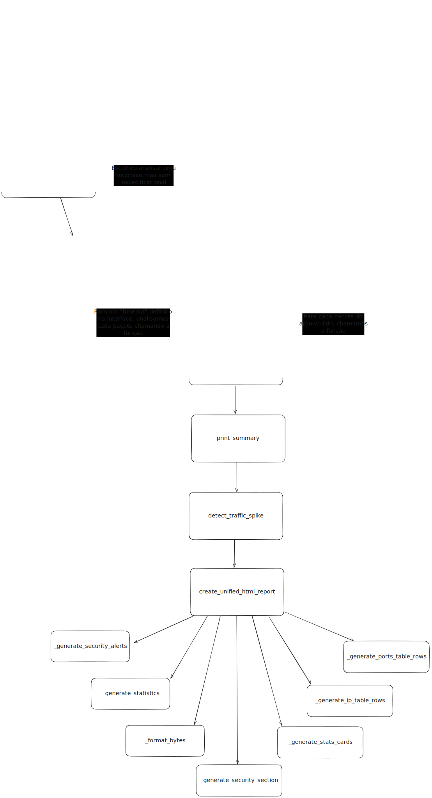
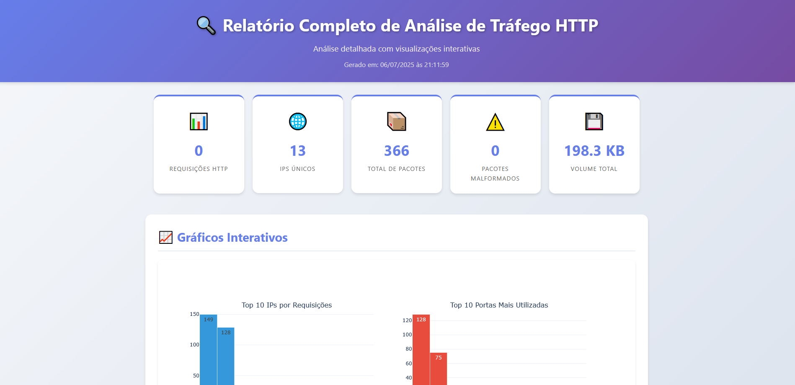
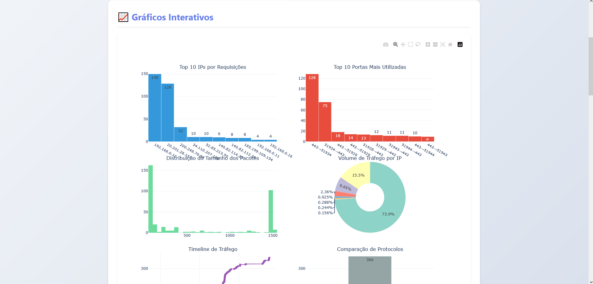
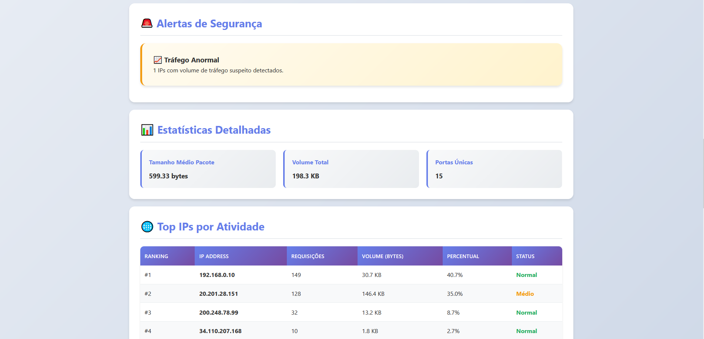

# HTTP Analyzer (Python)

Um analisador de tráfego HTTP em tempo real (ou via arquivos `.pcap`), desenvolvido em Python com a biblioteca `scapy`. O foco é facilitar a visualização de métricas relevantes e auxiliar na detecção de comportamentos suspeitos em redes locais.

O projeto foi desenvolvido em ambiente acadêmico, na cadeira de Redes para o curso de Ciência da Computação da Universidade de Caxias do Sul.

---

## 🚀 Funcionalidades

- 📡 Captura pacotes HTTP ao vivo ou de arquivos `.pcap`
- 🔍 Analisa cabeçalhos IP, TCP e HTTP
- 📊 Métricas por camada:

  - IPs com mais requisições
  - Portas mais utilizadas
  - Tamanho médio dos pacotes HTTP

- ⚠️ Identifica:

  - Credenciais em texto plano (ex: `username`, `password`)
  - Pacotes malformados (flags inválidas)
  - Tráfego anormal de um único IP

---

## 🛠️ Requisitos

- Python 3.8 ou superior

- Bibliotecas Python:

  - Instale o scapy, plotly e jinja2

  ```bash
  pip install -r requirements.txt
  ```

- No **Windows**:

  - Instale o [Npcap](https://nmap.org/npcap/) com a opção `WinPcap API-compatible mode`

---

## 📦 Bibliotecas e utilização

- **scapy**: captura e análise dos pacotes da rede
- **plotly**: criação de gráficos para visualização das métricas
- **jinja2**: geração do HTML, utilizando templates

---

## ⚙️ Como usar

### 1. Captura ao vivo:

```bash
python main.py --timeout 30
```

> Será exibida uma lista de interfaces de rede. Escolha a desejada para iniciar a análise.

### 2. Analisar um arquivo `.pcap`:

```bash
python main.py --pcap exemplo.pcap
```

### 3. Especificar interface diretamente (avançado):

```bash
python main.py --iface "Realtek Gaming GbE Family Controller" --timeout 30
```

---

## 🗂️ Divisão do código

Todo o código vai estar dividido dentro da classe **HTTPTrafficAnalyzer**, segregando-se nas seguintes funções:

### Funções principais

| Função           | Descrição                                      | Obs                                                 |
| ---------------- | ---------------------------------------------- | --------------------------------------------------- |
| **main**         | Inicializa classe HTTPTrafficAnalyzer          | Função inicial                                      |
| analyze_packet   | Processa o pacote individualmente              |                                                     |
|                  |                                                |                                                     |
| analyze_pcap     | Realiza leitura do arquivo `.pcap`             | Quando há um arquivo `.pcap`                        |
|                  |                                                |                                                     |
| choose_interface | Escolhe a interface de rede que será analisada | Quando não é informado arquivo `.pcap` ou interface |
| analyze_live     | Realizar scan da interface por X segundos      |                                                     |

### Funções auxiliares

| Função                      | Descrição                                                                                                                   |
| --------------------------- | --------------------------------------------------------------------------------------------------------------------------- |
| print_summary               | Gera métricas simplificadas, escritas no terminal                                                                           |
|                             |                                                                                                                             |
| create_unified_html_report  | Gera HTML do relatório completo, unificando templates e funções auxiliares                                                  |
|                             |                                                                                                                             |
| \_generate_security_alerts  | Verifica se tem algum pacote com falha de segurança e atribui um status para o sistema. Ex: "Normal", "Tráfego Anormal"..." |
| \_generate_security_section | Gera o HTML dos alertas (se existir)                                                                                        |
|                             |                                                                                                                             |
| \_generate_statistics       | Calcula tamanho dos pacotes, tráfego e portas...                                                                            |
| \_generate_stats_cards      | Gera o HTML das estátisticas                                                                                                |
|                             |                                                                                                                             |
| \_generate_ip_table_rows    | Gera os registros da tabela de IPs mais utilizados                                                                          |
| \_generate_ports_table_rows | Gera os registros da tabela das portas mais utilizadas                                                                      |
|                             |                                                                                                                             |
| detect_traffic_spike        | Detecta se o volume em determinado ponto é incomum                                                                          |
| \_get_service_type          | Mapeia a porta para um tipo específico                                                                                      |
| \_format_bytes              | Formata os bytes para medidas mais amigáveis, como KB, MB, GB...                                                            |

---

## 🧑‍🏭Funcionalidades do relatório

| Métrica                             | Descrição                                                                                                                                                                         |
| ----------------------------------- | --------------------------------------------------------------------------------------------------------------------------------------------------------------------------------- |
| Requisições HTTP                    | Contagem da quantidade de requisições HTTP                                                                                                                                        |
| IPs únicos                          | Contagem da quantidade de IPs diferentes detectados                                                                                                                               |
| Total de pacotes                    | Quantidade total de pacotes detectados                                                                                                                                            |
| Pacotes malformatados               | Pacotes que possuem flags TCP fora do intervalo válido (0 a 255)                                                                                                                  |
| Volume total                        | Volume total de todos pacotes somado                                                                                                                                              |
|                                     |                                                                                                                                                                                   |
| **Gráficos Interativos**            |                                                                                                                                                                                   |
| Top 10 IPs por requisições          | Gráfico com os 10 IPs mais utilizados                                                                                                                                             |
| Top 10 portas mais utilizadas       | Gráfico com as 10 portas mais utilizadas                                                                                                                                          |
| Distribuição do tamanho dos pacotes | Contagem dos pacotes agrupados pelo tamanho                                                                                                                                       |
| Volume de tráfego por IP            | Representa a quantidade total de dados (em bytes) transmitidos por cada endereço IP de origem durante a captura de pacotes.                                                       |
| Timeline de tráfego                 | Distribuição da quantidade de pacotes recebidos ao longo do tempo                                                                                                                 |
| Comparação de protocolos            | Distribuição dos protocolos utilizados                                                                                                                                            |
|                                     |                                                                                                                                                                                   |
| **Alertas de segurança**            |                                                                                                                                                                                   |
| 🔒 Credenciais Detectadas           | Vazamentos de termos sensíveis como `username`, `password`, `login` encontrados em payloads HTTP.                                                                                 |
| ⚠️ Pacotes Malformados              | Detectados pacotes TCP com flags fora do intervalo válido (0–255), indicando anomalia ou falha.                                                                                   |
| 📈 Tráfego Anormal                  | IPs com tráfego superior a 100.000 bytes (ajustável via parâmetro `threshold`), sinalizando possível atividade suspeita.                                                          |
| ✅ Sistema Normal                   | Nenhuma anomalia relevante foi identificada nos dados capturados.                                                                                                                 |
|                                     |                                                                                                                                                                                   |
| **Estatísticas detalhadas**         |                                                                                                                                                                                   |
| Tamanho médio dos pacotes           | Média do tamanho dos pacotes                                                                                                                                                      |
| Volume total                        | Volume total de todos pacotes somado                                                                                                                                              |
| Portas únicas                       | Quantidade total de portas diferentes detectadas                                                                                                                                  |
|                                     |                                                                                                                                                                                   |
| **Top IPs por atividade**           | Tabela listando os IPs mais utilizados, com a informação da: posição, IP, quantidade de requisições, Volume total dos pacotes, porcentagem da quantidade total de pacotes, status (Alto > 1MB, Médio > 100KB e Normal <= 100 KB) |
|                                     |                                                                                                                                                                                   |
| **Análise de portas**               | Tabela listando as portas mais utilizadas, com a informação da: porta de origem, porta destino, quantidade de conexões e tipo de serviço                                          |
|                                     |

## 📊 Fluxo do Sistema

Esta imagem demostra o fluxo das chamadas das principais funções do código desenvolvido. Não foram mapeadas funções internas de bibliotecas, apenas funções desenvolvidas pelos alunos.



---

## 📊 Imagens do relatório gerado pelo programa







---

## 🧾 Licença

Este projeto é open source sob a licença MIT.

---

## 👨‍💻 Autor

Desenvolvido por Augusto Zanesco Bortoncello e Gabriel Gallina Moscone como parte de um projeto acadêmico para a cadeira de Redes no curso de Ciência da Computação.
